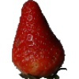
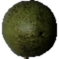
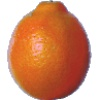
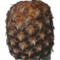

# Fruit classifier
This project is a simple fruit classifier trained with the [Fruits 360 dataset](https:///www.kaggle.com/moltean/fruits), available on Kaggle.

## Fruits 360 dataset
The [Fruits 360 dataset](https:///www.kaggle.com/moltean/fruits) contains 131 classes for a total of 82110 images. It was created from extracting frames of 20-second recordings of fruits rotating on a motor. All the images were rescaled to 100x100 pixels and the background of all images has been removed. Some image examples are:

## Model
 The CNN model is implemented in `Tensorflow` with `Keras`. The backbone used for transfer learning is the ResNet50, pre-trained on [ImageNet](https://www.image-net.org/update-mar-11-2021.php). The top and output layers to be trained are:
 - A fully connected layer with 1024 neurons, activaded by ReLU (Rectified Linear Unit);
 - A fully connected output layer with 131 neurons, activaded by Softmax. This is used to get the probability of each one of the 131 classes.

## Results
The metrics obtained with the test set are the following:
 - Accuracy: 0.9017
 - Loss: 1.3492